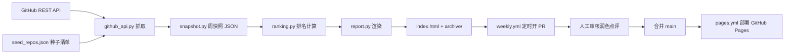

# 开发文档 · GitHub AI 周榜

面向后续更新迭代的维护手册。项目决策背景见 [CONTEXT.md](../CONTEXT.md)，日常使用见 [README.md](../README.md)。

## 1. 项目定位

每周从 GitHub 抓取 AI 相关开源库的**周快照**，用快照差值计算**周增量**，生成自包含 HTML 周报并部署到 GitHub Pages。数据可回溯：每周快照与历史报告全部提交进仓库。

## 2. 架构与数据流



关键设计：**快照是唯一事实源**。所有排名、趋势、点评都从 `data/snapshots/` 里的 JSON 派生，因此任何一期都可以离线复现。

## 3. 目录结构

```text
.
├── data/
│   ├── seed_repos.json            精选种子清单（owner/repo/category）
│   └── snapshots/YYYY-MM-DD.json  每周快照（保留全部历史）
├── src/github_ai_weekly/
│   ├── config.py                  路径、榜单参数、分类与 topic 规则
│   ├── github_api.py              GitHub REST API 客户端（鉴权/重试/限流退避）
│   ├── snapshot.py                快照构建、校验、读写
│   ├── ranking.py                 过滤、周增量、主榜/新面孔/分类榜、趋势
│   ├── report.py                  报告上下文组装 + Jinja2 渲染
│   ├── cli.py / __main__.py       命令行入口（fetch/report/sample）
│   ├── sample_data.py             离线演示数据
│   └── templates/report.html.j2   自包含 HTML 模板（CSS/JS 内联）
├── tests/                         pytest 验收测试
├── .github/workflows/
│   ├── weekly.yml                 每周定时：测试→抓取→生成→开 PR
│   └── pages.yml                  合并 main 后发布 GitHub Pages
├── index.html                     最新一周报告
└── archive/YYYY-MM-DD.html        历史报告
```

## 4. 模块职责

| 模块 | 职责 | 关键函数 |
| --- | --- | --- |
| `github_api.py` | 封装 REST API；`GITHUB_TOKEN` 鉴权；403/429 按 Retry-After 退避；搜索结果规整为快照记录 | `search_repos`、`fetch_repo`、`to_record` |
| `snapshot.py` | 合并种子清单 + topic 发现；快照结构校验；JSON 读写 | `build_snapshot`、`discover_repos`、`validate_snapshot`、`save_snapshot` |
| `ranking.py` | 榜单口径与全部排名计算（纯函数，无 IO） | `filter_repos`、`compute_deltas`、`main_ranking`、`new_faces`、`category_rankings`、`star_history` |
| `report.py` | 组装模板上下文、自动点评草稿、渲染确定性 HTML | `build_context`、`auto_commentary`、`render_report` |
| `cli.py` | 命令入口与错误提示 | `cmd_fetch`、`cmd_report`、`cmd_sample` |

## 5. 数据模型

快照 JSON（`data/snapshots/YYYY-MM-DD.json`）：

```json
{
  "date": "2026-08-08",
  "source": "github-api",
  "repos": {
    "openai/whisper": {
      "stars": 90000,
      "forks": 2000,
      "description": "...",
      "language": "Python",
      "topics": ["audio", "speech-recognition"],
      "url": "https://github.com/openai/whisper",
      "category": "multimodal",
      "archived": false,
      "fork": false,
      "is_template": false,
      "pushed_at": "2026-08-01T00:00:00Z"
    }
  }
}
```

排名项（`ranking.py` 产物）在 `full_name`、`record`、`weekly_gain`（无历史为 `null`）、`daily_est`（= 周增量 ÷ 7，估算值）、`is_new` 之外，`report.py` 会追加 `category_label`、`bar_pct` 等展示字段。

## 6. 配置项（`src/github_ai_weekly/config.py`）

| 配置 | 默认 | 说明 |
| --- | --- | --- |
| `MIN_STARS` | 1000 | 总星标门槛，低于此值不进榜单 |
| `TOP_N` | 30 | 主榜长度 |
| `CATEGORY_TOP_N` | 10 | 每个分类子榜长度 |
| `DISCOVER_TOP_N` | 30 | 每个 topic 发现取前 N（按总星） |
| `TOPICS` | 32 个 topic | topic 发现词列表，逐个查询 |
| `TOPIC_TO_CATEGORY` | — | 由仓库自身 topics 推断分类的映射 |
| `CATEGORY_LABELS` | 9 类 | 分类 key → 中文展示名 |

## 7. 本地开发

```bash
# 构建环境（uv）
uv venv .venv
uv pip install --python .venv/bin/python -e ".[dev]"

# 跑测试
.venv/bin/python -m pytest

# 离线演示（无需 token）
.venv/bin/python -m github_ai_weekly sample

# 真实抓取与生成（需要 token）
GITHUB_TOKEN=ghp_xxx .venv/bin/python -m github_ai_weekly fetch
.venv/bin/python -m github_ai_weekly report
```

`report` 支持 `--notes "……"` 追加人工点评（多段可多次传参）。

## 8. 每周更新流程

### 自动（推荐）

1. `weekly.yml` 每周一 **00:30 UTC = 北京时间 08:30** 触发：跑 pytest → `fetch`（当日快照）→ `report`（更新 `index.html` + `archive/`）→ 用 `peter-evans/create-pull-request` 开 PR。
2. 人工在 PR 中审核并润色「本周探讨」点评后合并。
3. 合并触发 `pages.yml`，自动部署。

### 手动

```bash
.venv/bin/python -m github_ai_weekly fetch --date 2026-08-15
.venv/bin/python -m github_ai_weekly report --notes "本周观察：……"
```

### 调整排期

改 `.github/workflows/weekly.yml` 的 `cron` 表达式。注意 Actions 的 cron 是 UTC。

## 9. 部署（GitHub Pages）

- 仓库 **Settings → Pages → Source** 选择 **GitHub Actions**（需手动开一次）。
- `pages.yml` 只发布 `index.html` 与 `archive/` 到 `_site` 临时目录；仓库其余内容不会暴露在 Pages 上。
- 首次推送时若还没有 `index.html`，会部署一个「首期周报即将生成」占位页，避免工作流失败。
- 手动触发部署：Actions → Deploy to GitHub Pages → Run workflow。

## 10. 迭代指南

### 10.1 增删种子仓库

编辑 `data/seed_repos.json`，注意：

- `owner`/`repo` 大小写必须与 GitHub 一致；
- `category` 必须是 `CATEGORY_LABELS` 里的 key；
- 仓库被改名/私有化会抓取 404，日志出现 `WARNING 种子仓库抓取失败`，应及时从清单移除或更正（不要留僵尸条目）。

### 10.2 新增或调整分类

1. `config.py` 的 `CATEGORY_LABELS` 增加 `key: 中文名`；
2. `data/seed_repos.json` 中的条目使用该 key；
3. 如需自动归类，在 `TOPIC_TO_CATEGORY` 增加 topic → 分类映射；
4. 分类子榜按 `CATEGORY_LABELS` 顺序自动生成，无需改模板。

### 10.3 调整榜单参数

改 `config.py` 的 `MIN_STARS` / `TOP_N` / `CATEGORY_TOP_N` / `DISCOVER_TOP_N`，重新生成报告即可。

### 10.4 扩展数据源（计划中的增强）

- **OSS Insight 公开 API**：可提供真实日增幅与交叉校验。建议在 `snapshot.py` 增加可选 enrichment 步骤，`ranking.py` 增加「真实日均」列，原估算列标注口径。
- **每日快照**：另加一个 daily 工作流每天 `fetch`，周报的日增幅用真实差值（不再 `delta/7` 估算）。注意 `fetch` 目前以「当天日期」命名快照，每日快照与每周快照会共存于 `data/snapshots/`，`latest_snapshot()` 取最新日期，需在 CLI 里按周聚合（按 ISO 周号取整周快照）。

### 10.5 修改设计

- 模板：`src/github_ai_weekly/templates/report.html.j2`（自包含，CSS/JS 全部内联）。
- 颜色/字体用 CSS 变量：`:root` 是亮色、`[data-theme="dark"]` 是暗色，语义 token（`--surface`、`--text`、`--accent` 等）不要写死十六进制到组件里。
- 改完必须重新 `report` 并跑测试（有确定性渲染断言）。

### 10.6 新增榜单/图表

1. `ranking.py` 增加纯计算函数；
2. `report.py` 的 `build_context` 组装进上下文；
3. 模板增加 section；
4. `tests/test_ranking.py` / `tests/test_report.py` 增加断言。

## 11. 测试与验收

- 当前 28 项 pytest，覆盖：API 客户端（含限流重试）、快照校验、排名计算、HTML 确定性渲染与转义、CLI 演示链路。
- 新增功能**必须**带可量化测试；渲染类功能至少断言：关键标记存在、同输入同输出、HTML 可解析。
- 项目规范（AGENTS.md）：每完成一个可运行阶段，跑通测试后以 **lile** 身份提交，提交信息简要描述修改点。

## 12. 已知限制与踩坑记录

这些是血泪教训，改代码前先读：

1. **Search API 的 `OR` 不作用于 qualifier**：`topic:a OR topic:b` 会直接 422（"logical operators only apply to text"）。发现逻辑必须**逐 topic 查询再合并**（`discover_repos` 已实现，不要改回 OR 写法）。
2. **没有官方 trending API**：周增量只能靠快照差值，不能靠 Search API 排序。
3. **stargazer 接口有 4 万条分页上限**：超大仓库拿不到完整 star 历史，所以「日均估算 = 周增量 ÷ 7」是估算值，报告中已标注。
4. **表头不要加 `position: sticky` + `top` 偏移**：会导致表头悬浮在距视口顶部偏移位置、看起来不在表格顶端（`cf1d724` 已修复，勿回归）。
5. **限流**：未登录 60 次/时、登录 5000 次/时；Search 未登录 10 次/分、登录 30 次/分。403/429 会自动退避，但 `GITHUB_TOKEN` 是必需的。
6. **快照校验**：全量抓取失败（如断网）会产生空快照，`validate_snapshot` 会拒绝保存，不会污染历史。

## 13. 提交与发布约定

- 提交身份：`lile`（本仓库已配置 `user.name=lile`、`user.email=13637474409@163.com`）。
- 提交信息：中文，简明描述修改点。
- 敏感/本机文件不入库：`.codex/`、`AGENTS.md`、`demo/`、`__pycache__` 等已在 `.gitignore`；新增敏感文件时同步忽略。
- 合并到 `main` 即触发 Pages 发布；紧急发布可手动 Run workflow。

## 14. 快速排查表

| 症状 | 检查点 | 处理 |
| --- | --- | --- |
| `fetch` 报 401/403 | token 是否过期、是否勾选仓库读权限 | 重新生成 fine-grained PAT（Public Repositories read-only） |
| 搜索 422 | 查询里是否又用了 `OR` 连接 qualifier | 改回逐 topic 查询 |
| 种子仓库 404 | 仓库是否改名/私有 | 更新或移除 `seed_repos.json` 条目 |
| 快照「repos 必须是非空字典」 | 是否断网/无 token 全量失败 | 检查网络与 token 后重跑 |
| Pages 不更新 | Settings → Pages 是否选了 GitHub Actions | 手动 Run workflow，或等待部署队列 |
| 表头不在表格顶端 | 模板里是否有 `th` 的 sticky | 移除 sticky + top 偏移 |
